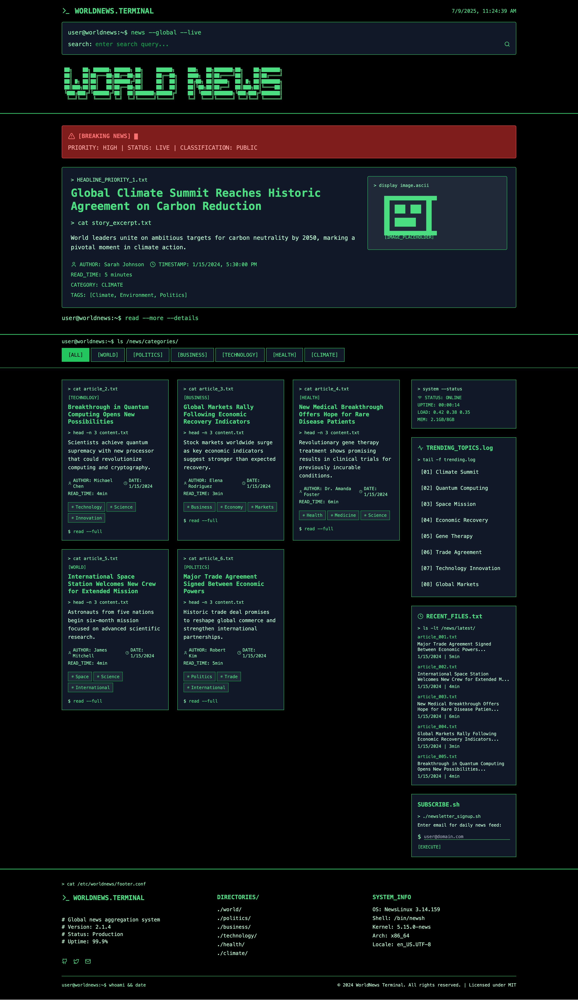

# WorldNews Terminal

A terminal-inspired, modern news aggregator built with React, TypeScript, Vite, and Tailwind CSS. WorldNews Terminal delivers a unique, retro command-line experience for browsing, searching, and filtering global news stories.

**[🌐 Live Demo](https://makalin.github.io/worldnews/)**

## Features

- **Terminal UI**: Authentic command-line look and feel, including ASCII art, system status, and prompt-style interactions.
- **Live Search**: Instantly filter news articles by keyword, category, or tag.
- **Category Tabs**: Browse news by World, Politics, Business, Technology, Health, and Climate.
- **Trending Topics**: Sidebar with real-time trending topics and quick navigation.
- **Featured Story**: Prominent hero section for breaking news and top headlines.
- **News Cards**: Each article displays metadata, tags, and a command-line inspired interface.
- **Sidebar Widgets**: System status, trending topics, latest articles, and a newsletter signup terminal.
- **Responsive Design**: Fully responsive, works on desktop and mobile.
- **Mock Data**: Uses mock news data for demonstration and development.

## Screenshots



*WorldNews Terminal - A modern news aggregator with terminal-inspired UI*

## Getting Started

### Prerequisites
- Node.js v18.18.0 or higher recommended
- npm (comes with Node.js)

### Installation
```bash
npm install
```

### Development
Start the local dev server:
```bash
npm run dev
```
Visit [http://localhost:5173](http://localhost:5173) in your browser.

### Build
To build for production:
```bash
npm run build
```

### Preview Production Build
```bash
npm run preview
```

## Project Structure

- `src/`
  - `components/` — UI components (Header, HeroSection, CategoryTabs, NewsCard, Sidebar, Footer)
  - `data/` — Mock news articles, categories, and trending topics
  - `types/` — TypeScript interfaces for news data
  - `main.tsx` — App entry point
  - `App.tsx` — Main application logic
- `index.html` — App HTML entry
- `vite.config.ts` — Vite configuration

## Data Model

- **NewsArticle**: id, title, excerpt, content, author, publishedAt, readTime, category, imageUrl, tags, isFeatured
- **NewsCategory**: id, name, slug

## Credits

- UI inspired by classic terminal/command-line environments
- Built with [React](https://react.dev/), [TypeScript](https://www.typescriptlang.org/), [Vite](https://vitejs.dev/), [Tailwind CSS](https://tailwindcss.com/)
- Icons by [Lucide](https://lucide.dev/)

## License

MIT 